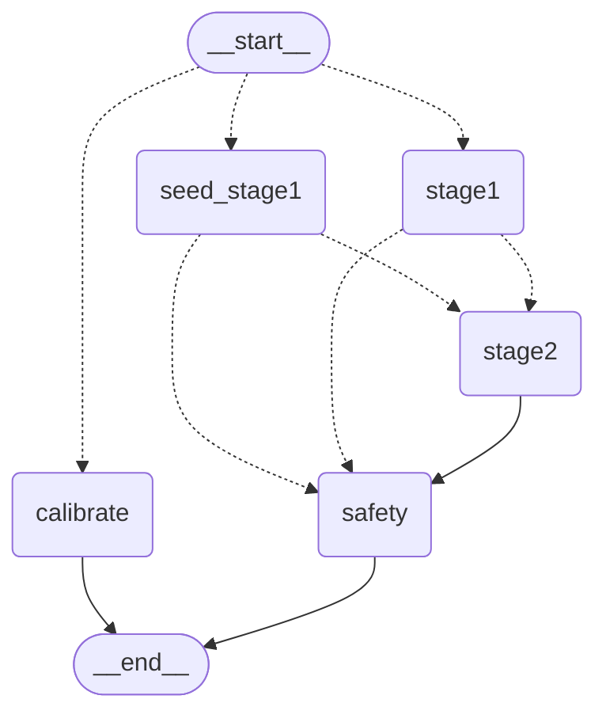

# Guidey

**ハンズフリー AI 作業ガイド** — カメラ越しに作業を見守り、音声で自律的にナビゲーションするエージェント。

料理や DIY の作業中、スマホを手に持たなくても、AI がカメラで状況を判断し、
「次はこうして」「火が強すぎます」と声で教えてくれる。

---

## Tech Stack

| Layer | Technology |
|---|---|
| **Mobile** | React Native / Expo / TypeScript / Tamagui v2 / Feature-sliced |
| **Backend** | FastAPI / Python 3.12 / 軽量 DDD |
| **Agent** | **LangGraph 単一 StateGraph** + **Structured Output** + `create_react_agent` |
| **State** | **AsyncRedisSaver** (langgraph-checkpoint-redis) / Redis 8+ / TTL 30 分 |
| **LLM** | Gemma 4 (Ollama, ローカル) / Claude Sonnet (API, エスカレーション時) |
| **RAG** | Milvus Lite + BM25 ハイブリッド / YouTube 自動取り込み |
| **Codegen** | OpenAPI → `openapi-typescript` でモバイル TS 型を自動生成 |
| **Voice** | expo-speech-recognition (STT) / expo-speech (TTS) |
| **Observability** | OpenTelemetry (Traces + Metrics) / LangSmith |
| **Lint/Format/Type** | ruff / pyright / expo lint / tsc |

---

## 自律エージェント

LangGraph の単一 StateGraph で定期監視 / ユーザー対話 / キャリブレーションを
宣言的に記述。`/periodic` と `/chat` は同じグラフを pipeline_type だけ切替えて呼ぶ。



- **stage1**: 高速判定 (Gemma, Structured Output)。
- **stage2**: エスカレーション時のみ `create_react_agent` + ツール利用 (Claude)。
- **safety**: 危険キーワード / 滞在時間 / 低確信度ガード + メモリ更新 + 最終 SSE 配信。
- **seed_stage1**: **将来のエッジ LLM 対応**。モバイルが事前計算した Stage1Output を持ち込める分岐。
- **calibrate**: 初期位置推定 (1-shot)。

Graph はすべて **`AsyncRedisSaver` で自動永続化** (thread_id = session_id、TTL 30 分、
refresh_on_read で延命)。画像 bytes は `config.configurable` 経由なので Redis に
焼き付かない。

詳細 → [docs/agent-architecture.md](docs/agent-architecture.md)

### ハーネス (安全装置)

LLM を信頼しすぎない多層ガード:

| Layer | 機能 |
|---|---|
| 入力ガード | 画像 10MB / JPEG,PNG,WebP / 768px リサイズ |
| コスト上限 | `session_max_stage2_calls=30` / `max_total_calls=500` / セッション |
| タイムアウト | periodic 30s / user_action 60s (`asyncio.timeout`) |
| Structured Output | Pydantic スキーマ検証で不正 JSON を排除 |
| 出力サニタイズ | message 500 文字 / blocks 5 個 / injection 対策 / URL 検証 |
| Safety ノード | 危険キーワード / 最低滞在時間 / 低確信度 anomaly ダウングレード |
| Mobile | 適応的サンプリング (3→10→20 秒) / Stuck 検知 / Lock / TTS 競合管理 |

**設計原則**: タイムアウト / コスト超過 / 低確信度は全て `continue` (現状維持) にフォールバック。

---

## SSE プロトコル

`/periodic` と `/chat` は共通の SSE プロトコル:

```
event: stage  data: {"stage":1,"escalated":true,"message":"少し調べますね",...}
event: stage  data: {"stage":2,"judgment":"next","message":"...","blocks":[...]}
event: done   data: {"current_step_index":2}
```

Stage1 の escalate 中間通知で UX を埋め、最終判定は safety ノード完了時に emit。

---

## ディレクトリ構造

```
guidey/
├── Makefile                     make help で全コマンド一覧
├── backend/
│   └── src/
│       ├── main.py              FastAPI app + lifespan (Redis checkpointer 初期化)
│       ├── routes/              HTTP 受け口 (薄い: 検証 + SSE ラップ)
│       ├── application/guide/   UseCase (orchestration)
│       │   ├── periodic/chat/session/plan_query/plan/analyze/feedback UseCase
│       │   ├── outputs.py       Stage1/Stage2/CalibrationOutput (Pydantic)
│       │   ├── sse_schemas.py   StageEvent (OpenAPI 露出用)
│       │   └── blocks.py        UI ブロック型
│       ├── domain/guide/        ドメインモデル + プロンプト (md)
│       ├── infrastructure/
│       │   ├── agent/
│       │   │   ├── graph.py     GuideGraph (StateGraph 本体)
│       │   │   ├── agent.py     AgentClient (Graph の唯一の入口)
│       │   │   └── tools.py     @tool (content_and_artifact)
│       │   ├── llm/             Ollama / Claude クライアント
│       │   └── rag/             Milvus + BM25 + embeddings
│       └── common/              telemetry / metrics / exceptions
│
├── mobile/
│   ├── app/                     Expo Router (薄い画面: ~120-245 行)
│   ├── features/                機能モジュール (Feature-sliced)
│   │   ├── autonomous/          useAutonomousLoop (edge-llm 差し込み口あり)
│   │   ├── chat/                useChat + ChatInput
│   │   ├── voice/               useSpeechRecognition + useVoiceIntents
│   │   ├── feedback/ plan/
│   ├── components/
│   │   ├── ui/                  デザインシステム (Tamagui ラップ)
│   │   ├── layout/              PhoneVRLayout / SmartGlassesLayout (自動切替)
│   │   └── blocks/              ブロック描画 (Text/Image/Video/Timer/Alert)
│   └── lib/
│       ├── api/                 HTTP + SSE (schema.ts は OpenAPI 自動生成)
│       ├── edge-llm/            Stage1Runner interface (cloud / gemma-local / apple-foundation)
│       ├── theme/               tokens + 2 variants
│       ├── hooks/               useAgentState / useBlockRouter / useLayoutVariant
│       └── types/               Block / Plan / StageEvent (schema.ts から再 export)
│
└── docs/
    ├── agent-architecture.md    エージェント全容 (Mermaid 図付き)
    ├── api-architecture.md      Backend レイヤー構成・依存注入
    ├── mobile-architecture.md   モバイル構造・状態遷移 (5 フロー詳述)
    ├── rag-architecture.md      RAG パイプライン
    └── future-design.md         未実装の将来設計
```

---

## セットアップ

### 必須ランタイム

```bash
# Redis 8 (RedisJSON/RediSearch 必須)
docker run -d --name redis-stack --restart unless-stopped \
  -p 6379:6379 redis/redis-stack-server:latest

# Ollama (LLM 実行)
brew install ollama && brew services start ollama
ollama pull gemma4:e4b
ollama pull nomic-embed-text
```

### 依存インストール

```bash
cp backend/.env.example backend/.env   # 必要なら編集
make install                           # uv sync + npm install
```

### 開発

```bash
make dev           # Redis up + BE 起動 (0.0.0.0:8000)
make dev-mobile    # 別ターミナルで Expo 起動
```

### OpenAPI から TS 型生成

```bash
# BE 起動中に
make gen-api       # → mobile/lib/api/schema.ts が更新
```

### Lint / Format / Typecheck

```bash
make lint          # ruff check + expo lint
make format        # ruff format/--fix + expo lint --fix
make typecheck     # pyright + tsc --noEmit
make check         # lint + typecheck (CI 用)
```

### コマンド一覧

```bash
make help
```

---

## ドキュメント

| ドキュメント | 内容 |
|---|---|
| [docs/agent-architecture.md](docs/agent-architecture.md) | LangGraph / Structured Output / Checkpointer / エッジ stage1 準備 / Mermaid 図 |
| [docs/api-architecture.md](docs/api-architecture.md) | レイヤー構成 / UseCase / SSE / DI / 設定 |
| [docs/mobile-architecture.md](docs/mobile-architecture.md) | Feature-sliced / 状態遷移 5 フロー / 排他制御 3 層 |
| [docs/rag-architecture.md](docs/rag-architecture.md) | RAG パイプライン / YouTube 取り込み |
| [docs/future-design.md](docs/future-design.md) | 未実装の将来設計 |

